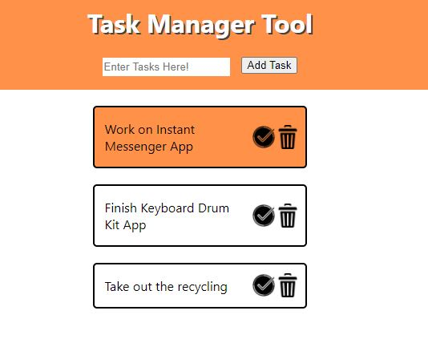

# Task Manager Tool 

This project's goal was to create a task manager tool that allows users to add, update and delete tasks they have up as they do them.
The base project was created using CRA and the only outside package included was "uuid" to generate unique ids for each task and help avoid name collisions.

## Example of the App

### How it works
The layout for this app was pretty straightforward. App is the main component and is the only truly stateful component, it stores all the state of the different tasks, while search bar uses state to receive the input value, and the task is stateless. The main functions I used were:

1) removeTask - a function which accepts an item id and filters state to return an array minus the selected task
2) addTask - a function which accepts a task and spreads the existing state and the new task object into a new state array
3) changeStatus - a function which takes an id and changes the corresponding state object to toggle the completion value

Tasks are added using the input and submit button. Task status is updated using the checkmark toggle button on the task itself, and items are deleted by clicking on the trash can icons on the tasks. A white task is incomplete, and a coral task has been completed